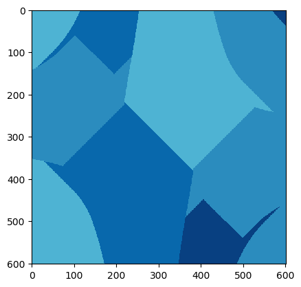

`mincolor` implements a [greedy coloring](https://en.wikipedia.org/wiki/Greedy_coloring) algorithm
for coloring regions of a map so that no two adjacent regions have the same color.

It can plot and save the resulting map (via matplotlib `imshow`) or export a
`cpt`file for use with the [Generic Mapping
Tools](http://gmt.soest.hawaii.edu/).




## usage

```
./mincolor.py <ncfile>
```

Export the .cpt file:

```
./mincolor.py <ncfile> -e
```


## Requirements

- numpy
- networkx
- matplotlib
- netCDF4


