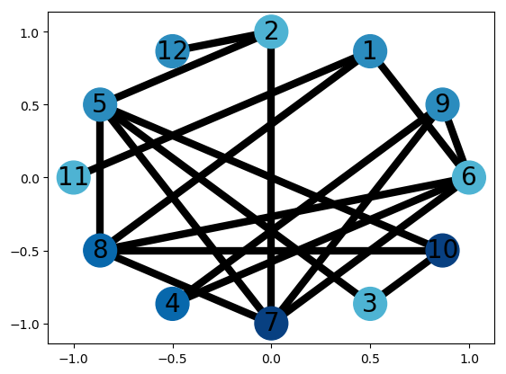

`mincolor` is a [greedy coloring](https://en.wikipedia.org/wiki/Greedy_coloring) algorithm
for coloring regions of a map so that no two adjacent regions have the same color.





## usage

```
./mincolor.py ncfile --varname 'z'
```

## Requirements

- numpy
- networkx
- matplotlib
- netCDF4


